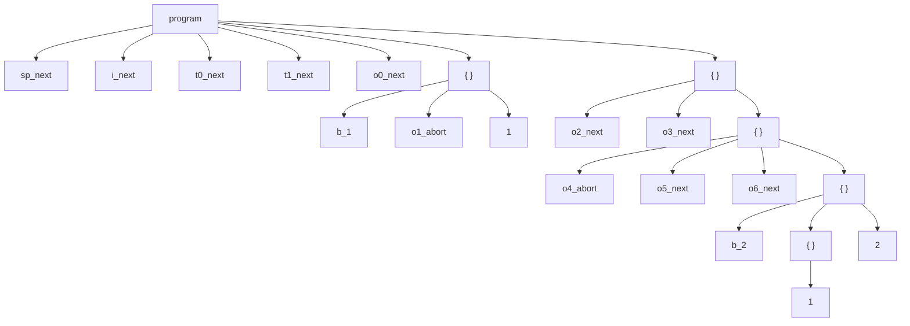
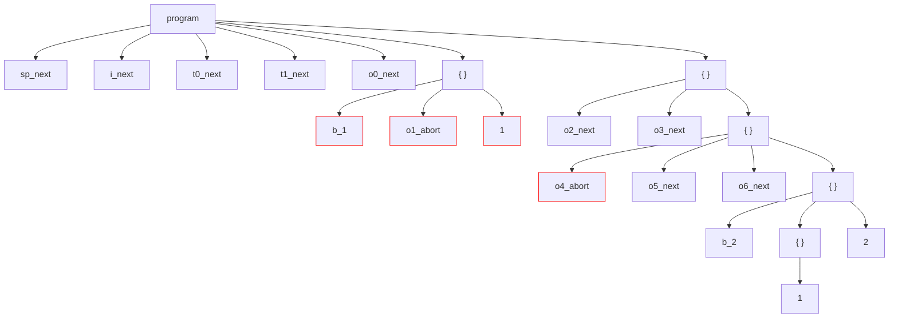
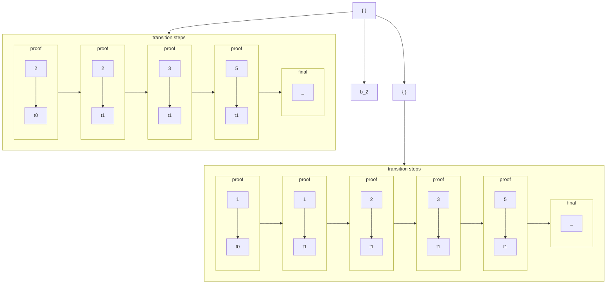

## Debug mode

An important aspect of testing the interpreter is the ability to debug, and that is also the case in this project. Control over the debugger parameters is possible through the [debug_config.yaml](../debugger/debug_config.yaml). To effectively use the implemented debugger, one must understand its behavior. The counting of the depth of individual program elements and the significance of main operations in debug mode will be described below.

In this document, we will use an example: [test_06.txt](../programs/test_06.txt).
The content of the example:

<pre>
@syntax(sp_next){sp: /unit/ | i}
@syntax(i_next){i: I}

@typing(t0_next){
    ---
    @G |- `@sp` : `unit`
}

@typing(t1_next){
    ---
    @G |- i`@i` : `unit`
}

@semantics(o0_next){
    ---
    < `@i`, @s > => < i`@i`, @s >
}


{
    @b_1
    @semantics(o1_abort){
        ---
        < i`1`, @s > => < i`1`, @s >
    }
    @code`1`
}

{
    @semantics(o2_next){
        ---
        < i`1`, @s > => < i`2`, @s >
    }

    @semantics(o3_next){
        ---
        < i`2`, @s > => < i`3`, @s >
    }

    {
        @semantics(o4_abort){
            ---
            < i`3`, @s > => < i`4`, @s >
        }

        @semantics(o5_next){
            ---
            < i`3`, @ s> => < i`5`, @s >
        }

        @semantics(o6_next){
            ---
            < i`5`, @s > => @s
        }

        {
            @b_2

            {
                @code`1`
            }
            
            @code`2`
        }
    }
}
</pre>

## Considerations

In the program, we will distinguish between two types of elements: program and proof.

### Program elements:
- **program**, the main entity, *+1 to depth for body*
- **block**, which technically is a program,
- **syntax rule**,
- **small-step operational semantics rule**,
- **typing rule**,
- **predicate definition**,
- **code**, *+1 to depth for body*
- **breakpoint**, which is processed only during debugging.

### Proof elements:
- **semantics rule**, *+1 to depth for upper part of rule*
- **transition**,
- **typing rule**, *+1 to depth for upper part of rule*
- **typing**,
- **apply predicate**.

Elements of proof: **transition**, **typing** and **apply predicate** are individual components from the upper parts of the **semantics** and **typing rules**.

As we can infer, the program from the input can be represented as a tree of program and proof elements. First, let's consider debugger operations on program elements, and then on the proof.

## Tree for example (only program elements)



We can definitively determine the depth of each element: (we will skip unnamed blocks)

depth 0 : program <br>
depth 1 : sp_next, i_next, t0_next, t1_next, o0_next <br>
depth 2 : b_1, o1_abort, \`1\`, o2_next, o3_next <br>
depth 3 : o4_abort, o5_abort, o6_next <br>
depth 4 : b_2, \`2\` <br>
depth 5 : \`1\`

## Provided operations

When the debugger is set to trace certain elements, it stops at them and waits for user operation. The user can perform:
- `next`,
- `skip`, (normal / all / global)
- `abort`. (normal / all / global)

`Next` operation go to next element of tree (Preorder), `skip - normal` operation skips trace of given element and its subtree, instead `abort - normal` aborts executing of elements and its subtree. If, however, the user switches to the `all` mode, the effect of the operation also includes subsequent elements at the same depth (the effect covers the element and the next siblings of its parent). `Global` operation effects on all nexts elements.

### Example of use:
Consider the drawn tree; if we use `abort - all` at the b_1 vertex, then the entire block in which it is located will not be executed. We can also use `abort - normal` at o4_abort. If we now use `next` in the remaining places, the program will work, and we will avoid looping and blocking transitions.



## Tree for modified example

At this point, I will dare to draw the continuation of the tree, adding the remaining elements - the proof. They are always in the subtrees of the codes. Therefore, let's focus on the block where the codes are located. Proofs for next steps are empty - we need only to check typings for them. ❗ Left son should be placed on the right.



> If we allowed the creation of o4_abort, what would happen? <br>
Of course, we want to avoid a dead-end in the small-step operational semantics, <br> so we will use `abort - normal` in the proof tree. <br><br>
Try do it by yourself, set debug config with true only for transition & breakpoint follow. `Abort-all` in b_1 and next in prove `abort - normal` with transition: 3 -> 4.

## Run debug mode
Run program with debug mode: (here [test_06.txt](../programs/test_06.txt))
```console
> python main.py programs/test_06.txt --debug
```