## Introduction

The small-step semantics allows understanding the behavior, the flow of the language, and the result produced by individual syntactic constructs. This semantics is available at the [link to Overleaf (view mode)](https://www.overleaf.com/read/bkzncfprpdkh#9766c8) and it pertains to this interpreter. It does not precisely describe its behavior, and therefore, this document will include descriptions of this semantics and discrepancies compared to the actual behavior of the tool.

Upload date of [semantics](./semantics/) - 04/02/2024 ❕ all visible screens may be outdated
❕ report bugs in issues - as documentation 

## Syntax description

Base | Construction | Unprocessed contruction
:-:|:-:|:-:
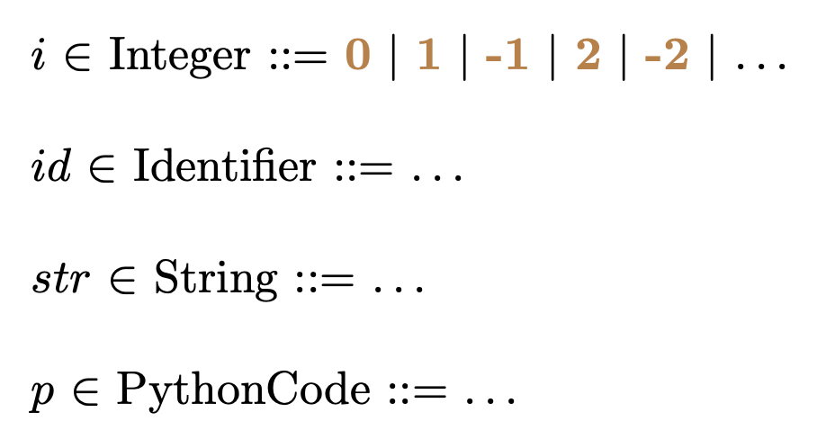 | 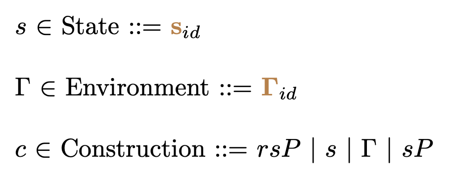 | 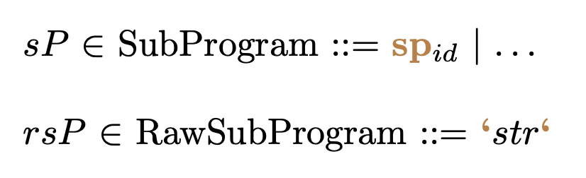

Apply & Def Predicate | Transition & Typing | Program
:-:|:-:|:-:
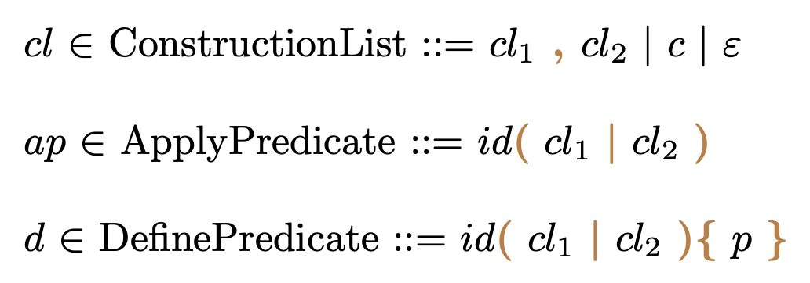 | 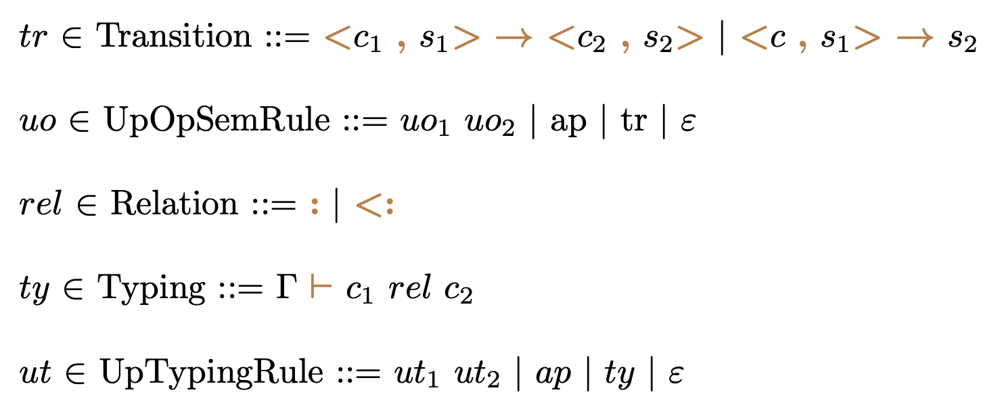 | 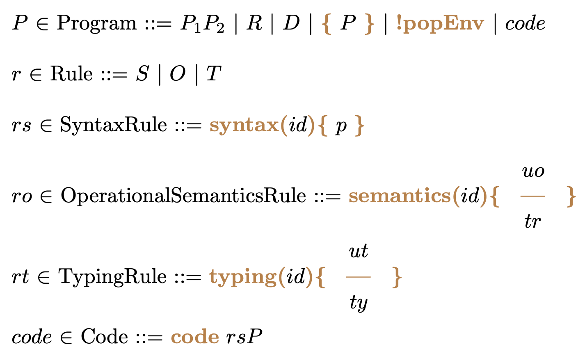

## Semantics elements

State, Configuration, Environments | Syntax Environment | Operational Semantics Environment
:-:|:-:|:-:
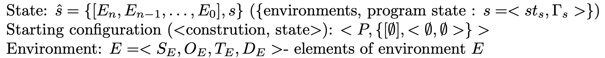 | 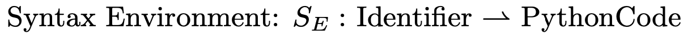 | 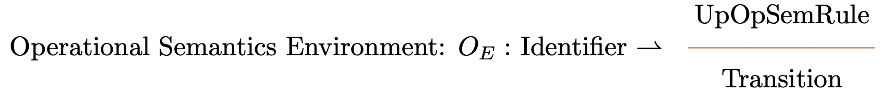

Typing Environment | Predicate Environment | Predefined predicates
:-:|:-:|:-:
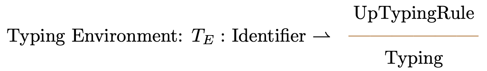 | 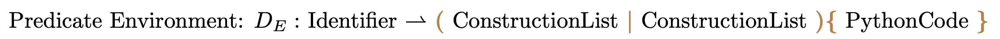 | 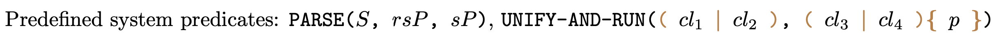

## Semantics description

TODO

## Discrepancies in Semantics Compared to the Actual Behavior of the Tool

TODO
