## Introduction

The small-step semantics allows understanding the behavior, the flow of the language, and the result produced by individual syntactic constructs. This semantics is available at the [link to Overleaf (view mode)](https://www.overleaf.com/read/bkzncfprpdkh#9766c8) and it pertains to this interpreter. It does not precisely describe its behavior, and therefore, this document will include descriptions of this semantics and discrepancies compared to the actual behavior of the tool.

Upload date of [semantics.pdf](./semantics/Only_semantics.pdf) - 04/02/2024 ❕ all visible screens may be outdated
❕ report bugs in issues - as documentation 

## Syntax description

Base | Construction | Unprocessed contruction
:-:|:-:|:-:
 |  | 

Apply & Def Predicate | Transition & Typing | Program
:-:|:-:|:-:
 |  | 

## Semantics elements

State, Configuration, Environments | Syntax Environment | Operational Semantics Environment
:-:|:-:|:-:
 |  | 

Typing Environment | Predicate Environment | Predefined predicates
:-:|:-:|:-:
 |  | 

## Semantics description

Parse transition rule | Parse upper part transition rule | Parse transition | Parse transition end
:-:|:-:|:-:|:-:|
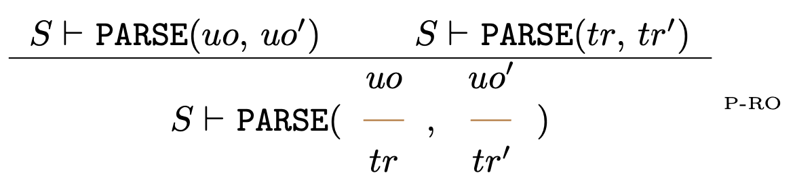 | 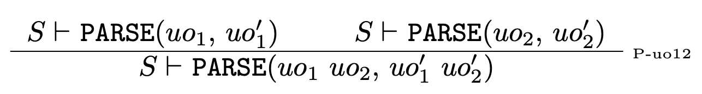 | 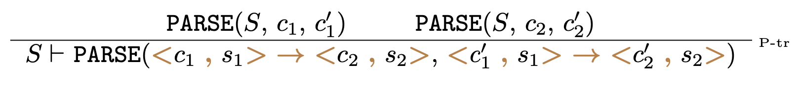 | 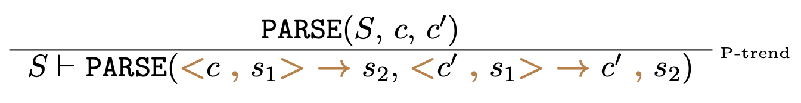

Parse typing rule | Parse upper part typing rule | Parse typing
:-:|:-:|:-:|
 | 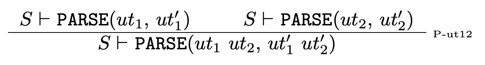 | 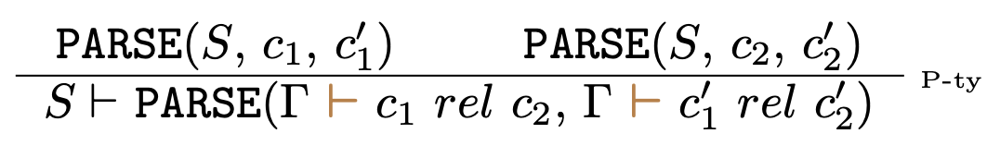

Parse predicate definition | Parse construction list | Parse construction | Parse apply predicate
:-:|:-:|:-:|:-:|
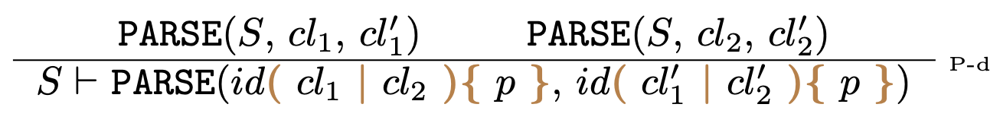 | 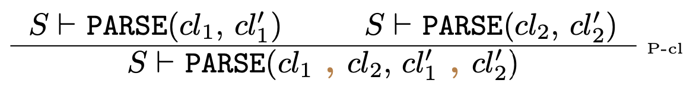 | 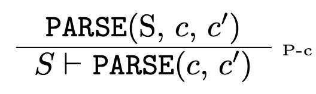 | 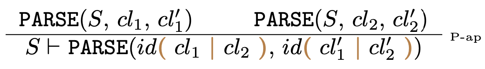

Two programs | Two programs, one program end
:-:|:-:|
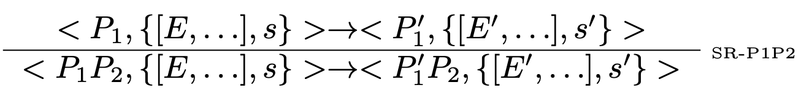 | 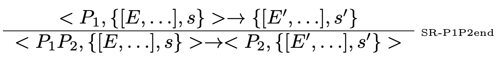

Syntax rule | Semantics rule | Typing rule | Definition (predicate)
:-:|:-:|:-:|:-:|
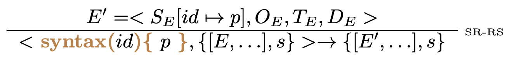 |  | 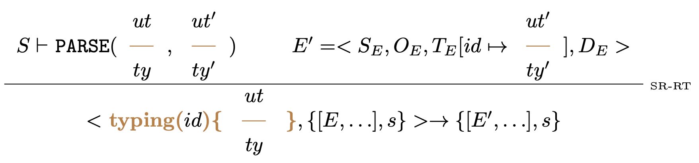 | 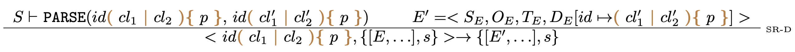

Block | Block end
:-:|:-:|
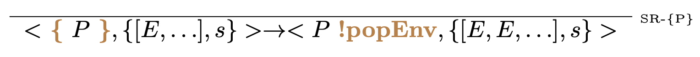 | 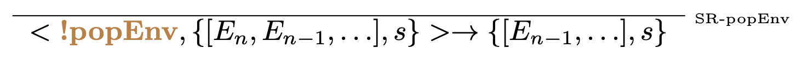

Raw subprogram | Subprogram | Subprogram end | Prove predicate
:-:|:-:|:-:|:-:|
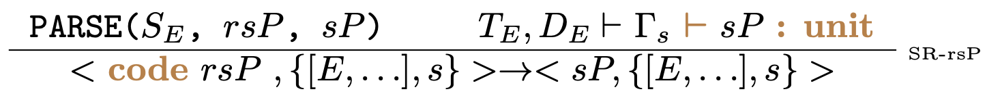 | 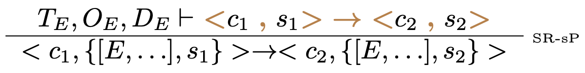 | 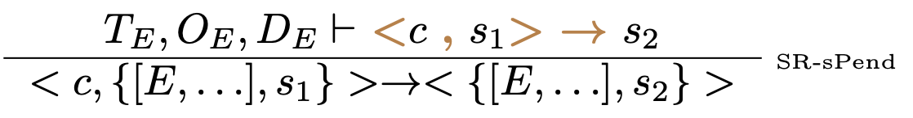 | 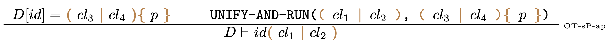

Prove upper part rule transition | Prove upper part rule transition - single | Prove empty upper part rule transition
:-:|:-:|:-:|
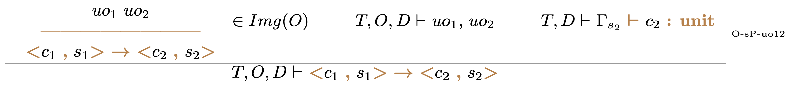 | 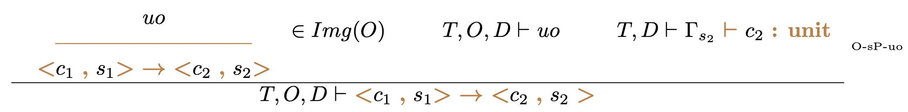 | 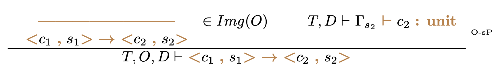 | 

Prove upper part rule transition end | Prove upper part rule transition - single end | Prove empty upper part rule transition end
:-:|:-:|:-:|
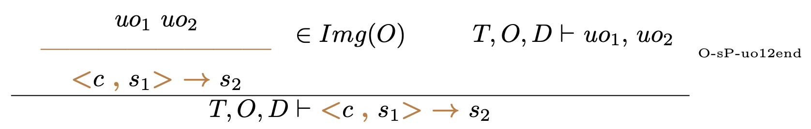 | 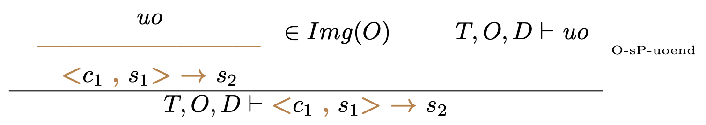 | 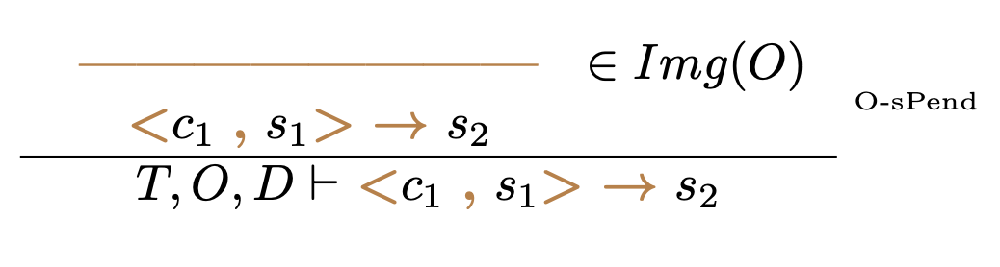 | 

Prove upper part rule typing | Prove upper part rule typing - single | Prove empty upper part rule typing
:-:|:-:|:-:|
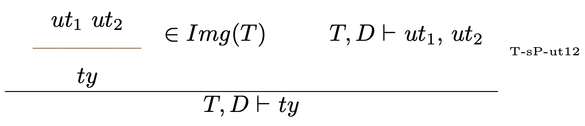 | 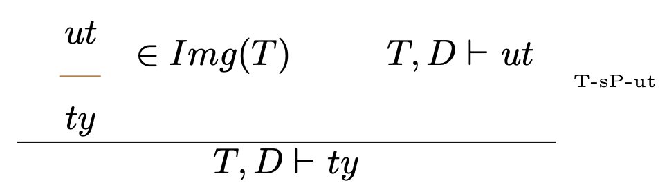 | 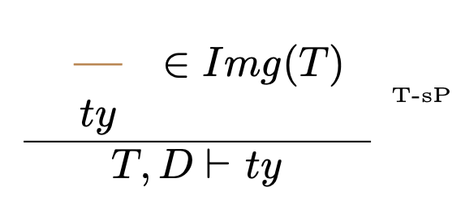

## Discrepancies in Semantics Compared to the Actual Behavior of the Tool

1️⃣ - The prove rules imply that the proof of the given transition/typing, if it exists, is used. In the tool, the proof is searched using depth-first search (DFS), so we can expect it to be the "first" proof created according to the order of generation, not random. Additionally, the searching mechanism does not guard against infinite loops. Therefore, in the case of an infinite proof tree, it may not transition to a finite, valid proof, as it would do with breadth-first search (BFS).

🔑 - Add the ability to compare rules, allowing for sorting and determining that during proof search, there is no rule with a smaller index.

2️⃣ - No debug mode in semantics.

🔑 - The information about whether debugging is enabled should be determined at the beginning. The ability to decide on the course of the program, proof transitions, type checking, and tracking breakpoints necessitates the existence of a structure that could contain/load user actions – something similar to Input. However, in this case, the proof semantics would need to be redefined to transition between specified states, just like the semantics of the program and code.

3️⃣ - Minor differences in notation – the '@' symbols are missing, which are present in the tool.

4️⃣ - In the semantics, the parser does not have the ability to load structures from a level other than sp – subprogram. In the tool, this capability exists, and in such cases, the unparsed construction needs to be expressed differently.

🔑 - Increase the capabilities of the predefined parsing predicate.
