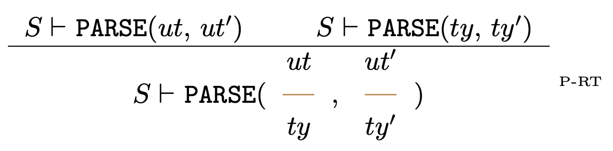
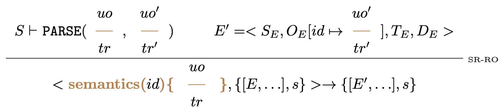

## Introduction

The small-step semantics allows understanding the behavior, the flow of the language, and the result produced by individual syntactic constructs. This semantics is available at the [link to Overleaf (view mode)](https://www.overleaf.com/read/bkzncfprpdkh#9766c8) and it pertains to this interpreter. It does not precisely describe its behavior, and therefore, this document will include descriptions of this semantics and discrepancies compared to the actual behavior of the tool.

Upload date of [semantics](./semantics/) - 04/02/2024 ❕ all visible screens may be outdated
❕ report bugs in issues - as documentation 

## Syntax description

Base | Construction | Unprocessed contruction
:-:|:-:|:-:
 |  | 

Apply & Def Predicate | Transition & Typing | Program
:-:|:-:|:-:
 |  | 

## Semantics elements

State, Configuration, Environments | Syntax Environment | Operational Semantics Environment
:-:|:-:|:-:
 |  | 

Typing Environment | Predicate Environment | Predefined predicates
:-:|:-:|:-:
 |  | 

## Semantics description

Parse transition rule | Parse upper part transition rule | Parse transition | Parse transition end
:-:|:-:|:-:|:-:|
 |  |  | 

Parse typing rule | Parse upper part typing rule | Parse typing
:-:|:-:|:-:|
 |  | 

Parse predicate definition | Parse construction list | Parse construction | Parse apply predicate
:-:|:-:|:-:|:-:|
 |  |  | 

Two programs | Two programs, one program end
:-:|:-:|
 | 

Syntax rule | Semantics rule | Typing rule | Definition (predicate)
:-:|:-:|:-:|:-:|
 |  |  | 

Block | Block end
:-:|:-:|
 | 

Raw subprogram | Subprogram | Subprogram end | Prove predicate
:-:|:-:|:-:|:-:|
 |  |  | 

Prove upper part rule transition | Prove upper part rule transition - single | Prove empty upper part rule transition
:-:|:-:|:-:|
 |  |  | 

Prove upper part rule transition end | Prove upper part rule transition - single end | Prove empty upper part rule transition end
:-:|:-:|:-:|
 |  |  | 

Prove upper part rule typing | Prove upper part rule typing - single | Prove empty upper part rule typing
:-:|:-:|:-:|
 |  | 

## Discrepancies in Semantics Compared to the Actual Behavior of the Tool

TODO
